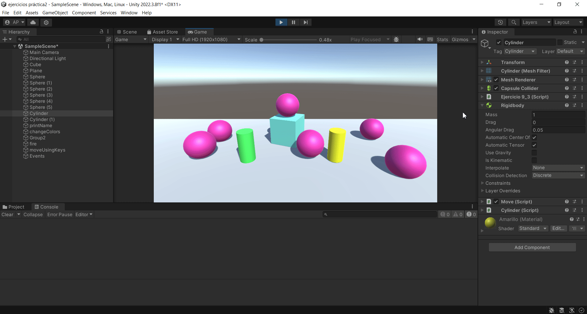
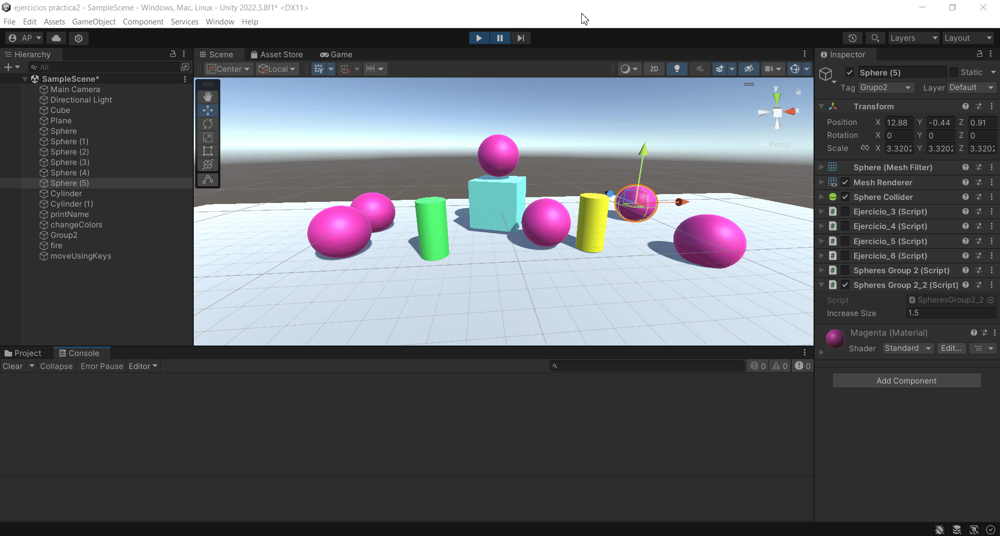
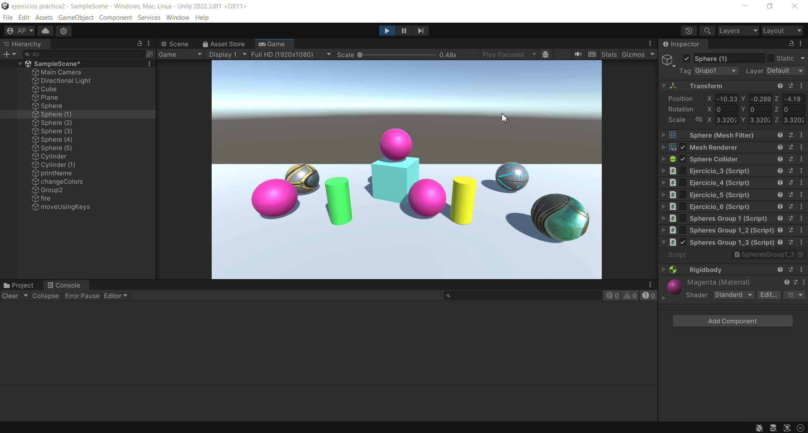
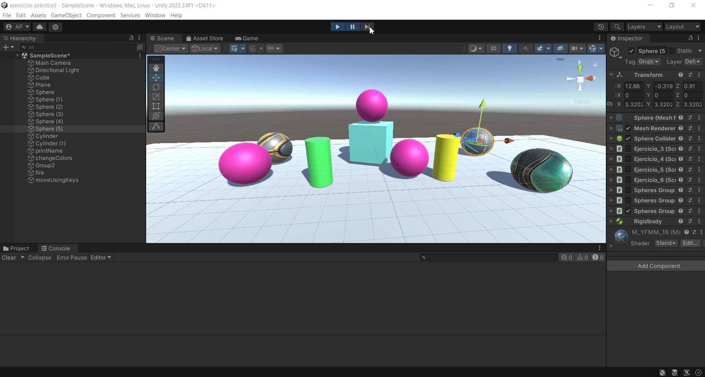
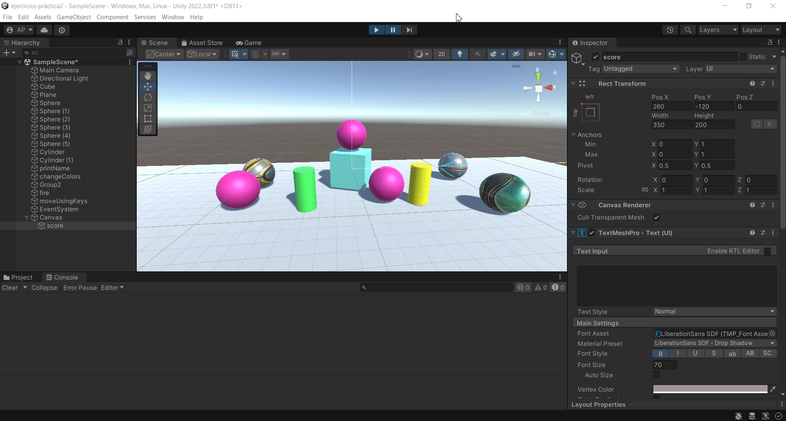

# Practica4-InterfacesInteligentes
## Delegados - Eventos
### Alicia Guadalupe Cruz Pérez
Se han realizado varios ejercicios de eventos en unity:

- **a) A partir de la escena que se ha estado utilizando en las [últimas prácticas](https://github.com/aliciagcp/Practica3-InterfacesInteligentes.git), crear la siguiente mecánica. Cuando el cubo colisiona con el cilindro, las esferas de tipo 1 cambian su color y las esferas de tipo 2 se desplazan hacia el cilindro.**

Notificador: [script](scripts/ejercicio1/Cylinder.cs)
Observador: [script](scripts/ejercicio1/SpheresGroup1.cs)
Observador: [script](scripts/ejercicio1/SpheresGroup2.cs)

  

- **b) Adaptar la escena anterior para que:**
   + **Cuando el cubo colisiona con cualquier objeto que no sean esferas del grupo 1, las esferas en el grupo 1 se acercan al cilindro.**
   + **Cuando el cubo toca cualquier esfera del grupo 1, las esferas del grupo 2 aumentan de tamaño.**

Notificador: [script](scripts/ejercicio2/Cube.cs)
Observador: [script](scripts/ejercicio2/SpheresGroup1_2.cs)
Observador: [script](scripts/ejercicio2/SpheresGroup2_2.cs)

  

- **c) Cuando el cubo se aproxima al cilindro, las esferas del grupo 1 cambian su color y saltan y las esferas del grupo 2 se orientan hacia un objeto ubicado en la escena con ese propósito.**

Notificador: [script](scripts/ejercicio3/Notifier.cs)
Observador: [script](scripts/ejercicio3/SpheresGroup1_3.cs)
Observador: [script](scripts/ejercicio3/SpheresGroup2_3.cs)

  

- **d) Implementar la mecánica de recoger esferas en la escena que actualicen la puntuación del jugador. Las esferas de tipo 1 suman 5 puntos y las esferas de tipo 2 suman 10. Mostrar la puntuación en la consola.**

Notificador: [script](scripts/ejercicio4/Notifier2.cs)
Observador: [script](scripts/ejercicio4/ScoreManager.cs)

  

- **e) Partiendo del script anterior crea una interfaz que muestre la puntuación que va obteniendo el cubo.**

Notificador: [script](scripts/ejercicio5/Notifier2.cs)
Observador: [script](scripts/ejercicio5/ScoreManager.cs)

  

- **f) Genera una escena que incluya elementos que se ajusten a la escena del prototipo y alguna de las mecánicas anteriores.**

Notificador: [script](scripts/ejercicio6/Notifier2.cs)
Observador: [script](scripts/ejercicio6/ScoreManager.cs)

Se han añadido nuevos objetos que actúan como minas en el juego. Estos al entrar en contacto con el cubo lo hacen volar por los aires y le restan 3 puntos en el contador. Por otra parte, el cubo al recoger una esfera cambia su material al de la esfera recogida.
